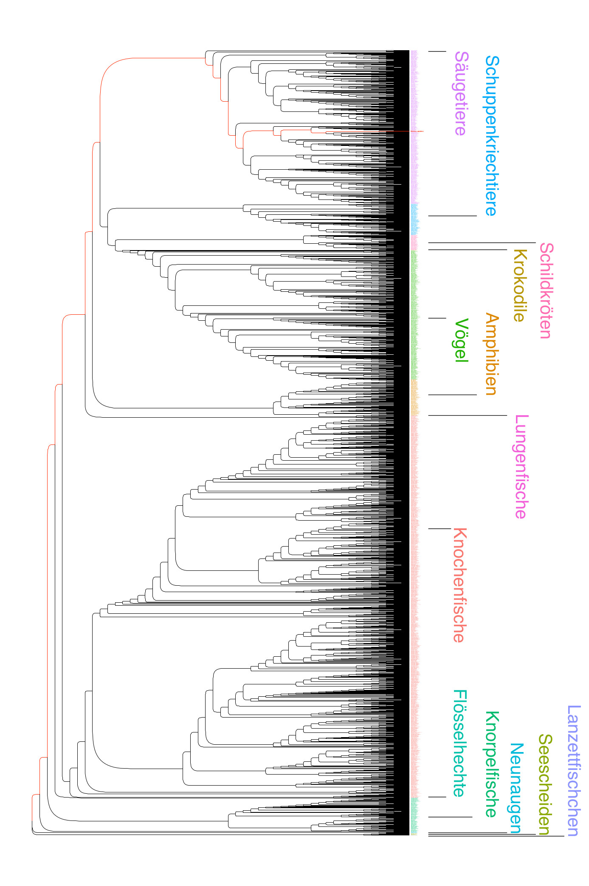

# Stammbaum der Chordatiere

Dieser Stammbaum (siehe auch unten) der Chordatiere wurde 2022 basierend auf Sequenzen aus einer DNA-Datenbank erstellt, indem man das Erbgut von Zellorganellen verglichen hat. Dafür am besten geeignet sind die Mitochondrien, die Kraftwerke tierischer und pflanzlicher Zellen. Ihr Genom (das ist die Gesamtheit des Erbguts) besteht bei Chordatieren aus ungefähr 15.000 Bausteinen („Buchstaben“). Unterschiede in den DNA-Sequenzen erlauben Rückschlüsse auf die Verwandtschaftsbeziehungen zwischen Arten und ermöglichen die Rekonstruktion deren Stammesgeschichte.  

Die Ast-Enden am rechten Rand des Baumes zeigen 3.625 heute lebende Arten. Nahe verwandte Arten sind durch wenige Verzweigungen getrennt, weit entfernt verwandte Gruppen, wie zum Beispiel Fische und Säugetiere, durch viele Verzweigungen. Die Ast-Gabelungen stellen ausgestorbene und meist unbekannte Vorfahren dar.   

Die Baumdarstellung übersetzt die in den DNA-Sequenzen enthaltene Information in ein fassbares Bild. Indem man den Stammbaum von rechts nach links liest, wird ein Blick zurück in die evolutionäre Vergangenheit möglich, selbst wenn es keine Fossilfunde gibt.

* * *

* * *

Bei Interesse an der zugrundeliegenden bioinformatischen Analyse, gibt es zusätzliche Information unter [PhylogenyDIY](https://github.com/nhmvienna/PhylogenyDIY).
